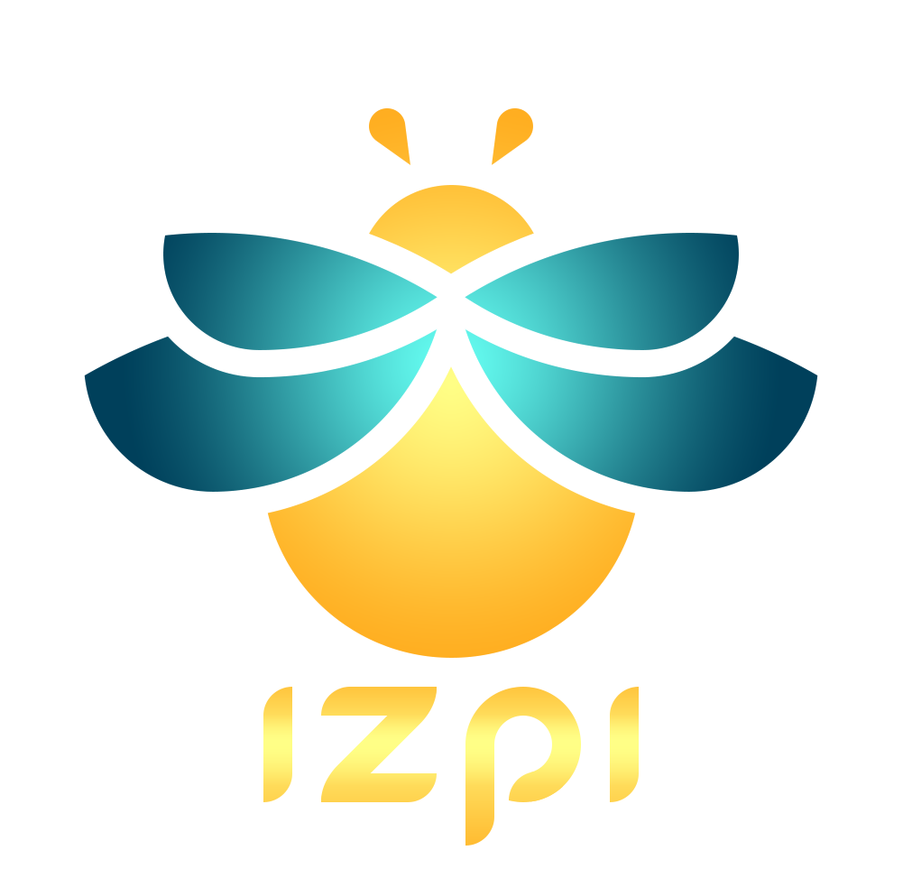

# IZPI - DeFi Pool Metadata Aggregator

<p align="center">
  
</p>

**IZPI** is a data collection and aggregation tool designed to scrape, store, and serve historical OHLCV (Open, High, Low, Close, Volume) and TVL (Total Value Locked) data from DeFi liquidity pools. The primary focus is on **Orca pools on Solana**, with plans to expand to other DEXs and networks.

The ultimate goal is to enable **backtesting of APR strategies** on liquidity pools, allowing users to simulate returns based on different liquidity deposit amounts and historical market conditions.

---

## Project Goals

1. **Data Aggregation**: Collect comprehensive historical data (OHLCV + TVL) for top liquidity pools
2. **Data Storage**: Maintain a local registry of pool metadata in structured JSON format
3. **API Access**: Provide a FastAPI-based REST API to query pool data
4. **Visualization**: Simple web interface to explore pool data
5. **Backtesting** *(Future)*: Enable APR simulation and strategy testing based on historical data

---

## Current Features

### Data Collection
- **Initial Scraping** (`metadata_scrapper.py`): 
  - Discovers top 200 pools from Orca (Solana) via GeckoTerminal API
  - Fetches complete historical OHLCV data (daily + hourly granularity)
  - Integrates TVL history from Dune Analytics
  - Stores data in JSON format per pool

- **Daily Updates** (`metadata_updater.py`):
  - Scheduled daily updates for existing pools
  - Incrementally adds new day/hour data
  - Batch TVL fetching for efficiency
  - Automatic duplicate detection

### Data Access
- **REST API** (`api/main.py`):
  - FastAPI-based endpoint
  - Query pool metadata by address
  - CORS-enabled for web interface

- **Web Interface** (`web/`):
  - Simple HTML/JS interface
  - Browse and visualize pool data
  - Served via Python HTTP server
  - Interactive candlestick charts using Lightweight Charts library
  - Real-time price data visualization with click-to-inspect functionality
  - Custom color scheme matching IZPI branding

---

## Data Structure

### Pool Metadata Format

Each pool is stored as `<pool_address>.json` with the following structure:

```json
{
    "meta": {
        "pool_address": "str",           // Unique pool identifier
        "name": "str",                   // Pool name (e.g., "SOL/USDC")
        "fee": "float",                  // Trading fee percentage
        "network": "str",                // Network (e.g., "solana")
        "dex": "str",                    // DEX name (e.g., "orca")
        "base": {
            "address": "str",            // Base token address
            "name": "str",               // Base token name
            "symbol": "str"              // Base token symbol
        },
        "quote": {
            "address": "str",            // Quote token address
            "name": "str",               // Quote token name
            "symbol": "str"              // Quote token symbol
        },
        "pool_created_at": [int, str],   // [Unix timestamp, ISO8601]
        "metadata_last_update": [int, str] // [Unix timestamp, ISO8601]
    },
    "data": [
        {
            "epoch": [int, str],         // Day timestamp [Unix, ISO8601]
            "tvl": float,                // Total Value Locked (USD)
            "open": [float, float],      // [USD price, Token price]
            "high": [float, float],      // [USD price, Token price]
            "low": [float, float],       // [USD price, Token price]
            "close": [float, float],     // [USD price, Token price]
            "volume": float,             // 24h volume (USD)
            "hour_data": [               // Hourly granularity data
                {
                    "epoch": [int, str],
                    "open": [float, float],
                    "high": [float, float],
                    "low": [float, float],
                    "close": [float, float],
                    "volume": float
                }
            ]
        }
    ]
}
```

**Key Features**:
- Dual timestamp format (Unix + ISO8601) for easy parsing
- Dual pricing (USD + token) for flexibility
- Nested hourly data within daily entries
- TVL snapshots at daily granularity

---

## Getting Started

### Prerequisites

- Python 3.8+
- Virtual environment (recommended)
- Dune Analytics API key (for TVL data)
- GeckoTerminal API access (free, rate-limited)

### Installation

1. **Clone the repository**:
```bash
git clone <your-repo-url>
cd izpi
```

2. **Set up virtual environment**:
```bash
python -m venv ~/venv_izpi
source ~/venv_izpi/bin/activate  # Linux/Mac
# or
~/venv_izpi/Scripts/activate     # Windows
```

3. **Install dependencies**:
```bash
pip install -r requirements.txt
```

4. **Configure API keys**:
Create a `keys/` directory and add:
- `keys/dune_api_key`: Your Dune Analytics API key
- `keys/dune_api_query_id`: Your Dune query ID for TVL data

---

## Usage

### Initial Data Collection

Run the scraper to collect historical data for all top Orca pools:

```bash
python scripts/metadata_scrapper.py
```

**Process**:
1. Fetches top 200 pools from Orca (sorted by default, volume, tx count)
2. Generates Dune Analytics query for TVL history
3. **Manual step**: Copy generated SQL to Dune, run query, press ENTER
4. Downloads complete OHLCV history for each pool
5. Stores data in `metadata/pools/pools_metadata/`

**Skip steps** (if re-running):
```python
# In metadata_scrapper.py
ignore_steps = ["A", "B"]  # Skip pool discovery and Dune query
pools_creation(network, dex, ignore_steps)
```

### Daily Updates

Run the updater to add new daily data:

```bash
python scripts/metadata_updater.py
```

Or use the shell script:
```bash
bash scripts/run_metadata_updater.sh
```

**Automation** (recommended):
Set up a daily cron job:
```bash
crontab -e
# Add: 0 1 * * * /path/to/izpi/scripts/run_metadata_updater.sh
```

### API Server

Start the FastAPI server:

```bash
cd ~/izpi
source ~/venv_izpi/bin/activate
uvicorn api.main:app --reload --port 9000
```

**API Endpoint**:
```
GET http://localhost:9000/pool/{pool_address}
```

Example:
```bash
curl http://localhost:9000/pool/HJPjoWUrhoZzkNfRpHuieeFk9WcZWjwy6PBjZ81ngndJ
```

### Web Interface

Start the web server:

```bash
cd ~/izpi/web
source ~/venv_izpi/bin/activate
python -m http.server 8000
```

Access the interface:
```
http://localhost:8000
```

**Features**:
- Enter pool address to load historical data
- Interactive candlestick chart with OHLCV data
- Click on any candle to see timestamp and closing price
- Custom dark theme with IZPI color palette:
  - Background: `#0d1822` (dark blue)
  - Container: `#00405b` (medium blue)
  - Accent: `#66fff2` (cyan), `#fffe86` (yellow), `#ffae21` (orange)
- Powered by [Lightweight Charts](https://tradingview.github.io/lightweight-charts/) by TradingView

**Usage Example**:
1. Enter a pool address (e.g., `2AEWSvUds1wsufnsDPCXjFsJCMJH5SNNm7fSF4kxys9a`)
2. Click "Load" to fetch data from the API
3. Explore the candlestick chart
4. Click any candle to see detailed price information

---

## Data Sources

### GeckoTerminal API

**Base URL**: `https://api.geckoterminal.com/api/v2`

**Rate Limits**: 30 calls/minute (handled automatically by scraper)

**Key Endpoints**:

1. **Top Pools**:
```
GET /networks/{network}/dexes/{dex}/pools?page={n}&sort={sort}
```
- `sort`: `h24_volume_usd_desc`, `h24_tx_count_desc`

2. **Multi-Pool TVL** (up to 30 pools):
```
GET /networks/{network}/pools/multi/{pool_id_1}%2C{pool_id_2}...
```

3. **OHLCV Data**:
```
GET /networks/{network}/pools/{pool_id}/ohlcv/{timeframe}?aggregate={agg}&limit={limit}&before_timestamp={ts}&currency={curr}
```
- `timeframe`: `day`, `hour`, `minute`
- `aggregate`: `1` (day/hour), `1,4,12` (hour), `1,5,15` (minute)
- `limit`: max `1000`
- `currency`: `usd`, `token`

### Dune Analytics

Used for historical TVL data (required for accurate backtesting).

**Manual Process**:
1. Script generates SQL query with all pool addresses
2. User copies query to Dune dashboard
3. User runs query and waits for completion
4. Script downloads results via Dune API

---

## Project Structure

```
izpi/
├── api/
│   └── main.py                    # FastAPI server
├── metadata/
│   ├── pools/
│   │   ├── pools_metadata/        # Individual pool JSON files
│   │   └── top_pools_info.json    # Pool registry
│   ├── queries/
│   │   ├── dune_query.sql         # Generated SQL query
│   │   ├── dune_query_sheet.sql   # SQL template
│   │   └── dune_query_result.json # Dune API results
│   └── examples/
│       └── pool_dayhour_metadata.json
├── scripts/
│   ├── metadata_scrapper.py       # Initial data collection
│   ├── metadata_updater.py        # Daily incremental updates
│   ├── run_metadata_scrapper.sh   # Scraper automation script
│   └── run_metadata_updater.sh    # Updater automation script
├── web/
│   ├── index.html                 # Web UI (pool address input, chart container)
│   ├── script.js                  # Frontend logic (API calls, chart rendering)
│   └── style.css                  # Styling (IZPI color scheme)
├── logs/                          # Timestamped execution logs
├── images/                        # Project branding assets
├── keys/                          # API keys (gitignored)
├── requirements.txt               # Python dependencies
└── README.md
```

---

## Configuration

### Supported Networks/DEXs

Currently configured for:
- **Network**: Solana
- **DEX**: Orca

To add more, modify in `metadata_scrapper.py`:
```python
network = "ethereum"  # or "arbitrum", "polygon", etc.
dex = "uniswap-v3"    # or "raydium", "meteora", etc.
```

### Rate Limiting

The scraper automatically handles GeckoTerminal's 30 calls/minute limit:
- Waits 0.25s between calls
- Pauses for 65s after 30 calls
- Retries failed requests up to 30 times

---

## Known Issues & Limitations

1. **Manual Dune Query Step**: TVL data requires manual query execution on Dune (API limitations)
2. **Fee Data Missing**: Pool fee percentages are not currently collected. Future implementation will use web scraping (BeautifulSoup) to extract fee data directly from pool pages and store in JSON/database
3. **No Database**: Currently uses JSON files (PostgreSQL migration in progress)
4. **Single Network**: Only Solana/Orca implemented (multi-chain coming)
5. **No Error Recovery**: Failed pool updates require manual re-run
6. **Log Accumulation**: Logs directory grows indefinitely (needs rotation)

---

## Roadmap

### Phase 1: Data Foundation (Completed)
- [x] Scrape top Orca pools
- [x] Store OHLCV + TVL data
- [x] Daily update mechanism
- [x] Basic API + web interface

### Phase 2: Data Enhancement (In Progress)
- [ ] **Database Migration**: Migrate from JSON to PostgreSQL for better performance and scalability
- [ ] **Fee Data Collection**: Implement web scraping (BeautifulSoup) to automatically extract pool fees from pool pages
- [ ] Add data validation and integrity checks
- [ ] **Multi-Network Support**: Add support for Sui, Ethereum, and BNB Chain
- [ ] More DEXs (Raydium, Meteora, Uniswap, PancakeSwap)
- [ ] Log rotation and management system

### Phase 3: Backtesting Engine (Planned - Next Months)
- [ ] **Client-Side APR Calculator**: JavaScript-based APR calculation engine running entirely in the browser
- [ ] **Raspberry Pi Deployment**: Self-hosted server setup for:
  - Serving the web interface
  - Daily automated scraping
  - API endpoint serving
- [ ] Liquidity position simulator
- [ ] Strategy backtesting framework with historical data replay
- [ ] Performance metrics (Sharpe ratio, max drawdown, win rate)
- [ ] Interactive web-based backtesting UI with parameter controls

### Phase 4: Advanced Features (Future)
- [ ] Real-time data streaming via WebSocket
- [ ] Impermanent loss calculator with historical accuracy
- [ ] Multi-position portfolio simulation
- [ ] Risk analysis tools (VaR, correlation matrices)
- [ ] Export results to CSV/Excel/PDF
- [ ] **Cloud Migration**: Transition from Raspberry Pi to cloud infrastructure for scalability

### Phase 5: Production Deployment (Long-term)
- [ ] User authentication and portfolio tracking
- [ ] Saved strategy templates
- [ ] Community-shared backtesting strategies
- [ ] API rate limiting and monetization
- [ ] Mobile-responsive UI optimization

---

## Contributing

This project is currently in active development. Contributions, suggestions, and bug reports are welcome!

---

## License

Copyright 2025 asierhv

Licensed under the Apache License, Version 2.0 (the "License");
you may not use this file except in compliance with the License.
You may obtain a copy of the License at

    http://www.apache.org/licenses/LICENSE-2.0

Unless required by applicable law or agreed to in writing, software
distributed under the License is distributed on an "AS IS" BASIS,
WITHOUT WARRANTIES OR CONDITIONS OF ANY KIND, either express or implied.
See the License for the specific language governing permissions and
limitations under the License.

---

## Contact

asierherranzv@gmail.com

---

## Acknowledgments

- **GeckoTerminal**: Real-time DEX data API
- **Dune Analytics**: Historical TVL data
- **Orca Protocol**: Leading Solana DEX